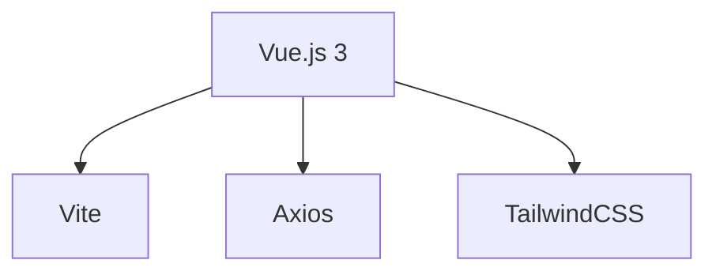

# 🩺 MediClassAI - Interface Clinique

<div align="center">
  
</div>

## ✨ Fonctionnalités
- **Saisie intuitive** de comptes-rendus médicaux
- **Visualisation des résultats** par spécialité
- Historique des analyses
- Mode sombre/clair

## 🛠 Stack Technique


## 🚀 Déploiement
```
# Variables d'environnement
VITE_API_URL = "https://medi-class-ai-back.onrender.com"
```

## 🏗 Installation Locale
```
git clone https://github.com/votre-user/medi-class-ai-front.git
cd medi-class-ai-front
npm install
npm run dev
```

## 🔗 Liens Importants
- Backend : GitHub

- API Docs : Swagger

- Figma : Maquettes
