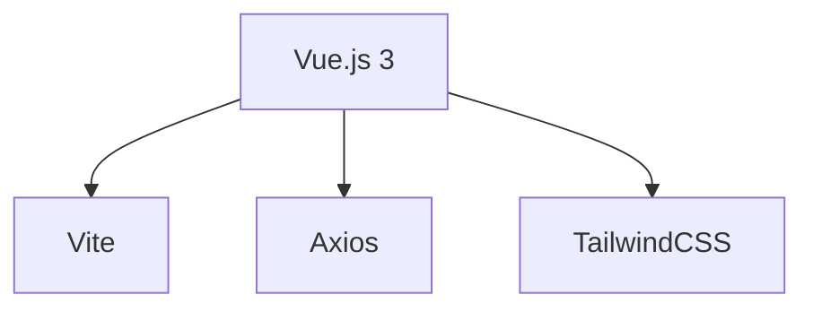

# 🩺 MediClassAI - Interface Clinique

<div align="center">
  
</div>

## ✨ Fonctionnalités
- **Saisie intuitive** de comptes-rendus médicaux
- **Visualisation des résultats** par spécialité
- Historique des analyses
- Mode sombre/clair

## 🛠 Stack Technique


## 🚀 Déploiement
```
# Variables d'environnement
VITE_API_URL = "https://medi-class-ai-back.onrender.com"
```

## 🏗 Installation Locale
```
git clone https://github.com/votre-user/medi-class-ai-front.git
cd medi-class-ai-front
npm install
npm run dev
```

## 🤝 Contribution
1. Forkez le projet
2. Créez une branche (`git checkout -b feat/ma-fonctionnalite`)
3. Committez (`git commit -m 'Ajout: Nouvelle fonctionnalité'`)
4. Pushez (`git push origin feat/ma-fonctionnalite`)
5. Ouvrez une Pull Request

## 📜 License
MIT © [Yann SALAKO](https://github.com/Yann2808/medi-class-ai-front)

[](https://www.linkedin.com/yann-salako)

[](https://github.com/Yann2808/medi-class-ai-back#readme)
